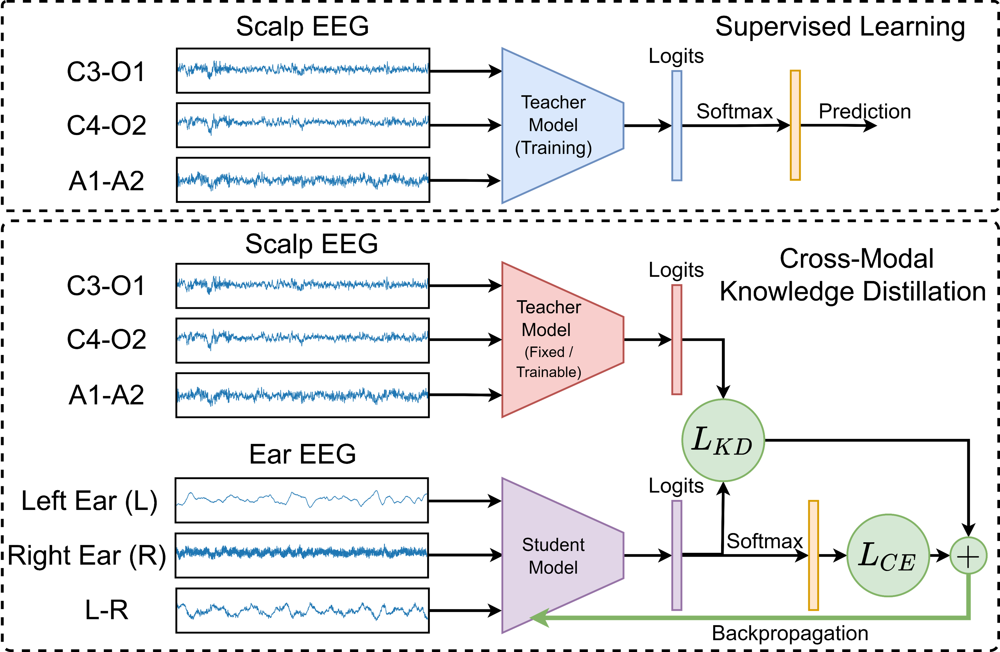

# EEG Assisted Enhanced Sleep Staging with Ear-EEG using Cross-Modal Knowledge Distillation

This repository contains implementation of cross modal knowledge distillation approach combining response based distillation to enhance ear-EEG based sleep staging using the scalp-EEG.



## Getting Started
[](https://colab.research.google.com/github/Mithunjha/EarEEG_KnowledgeDistillation/blob/main/EarEEG_KD_github.ipynb)

### Installation

The algorithms were developed in Pytorch Environment : [https://pytorch.org/](https://pytorch.org/)

```python
pip install torch==1.10.0+cu113 torchvision==0.11.1+cu113 torchaudio===0.10.0+cu113 -f https://download.pytorch.org/whl/cu113/torch_stable.html
```

Run below code to install all other dependencies

```python
pip install -r requirements.txt
```

## Training

### Training Phase 01 - Supervised Training

Initially models are trained in supervised manner on scalp-EEG recordings, this pretrained models are used as teacher models in knowledge distillation training.

```python
python main.py --data_path F:/Ear_EEG --train_data_list [0,1,2,3,5,6,7] --val_data_list [8] --signals ear-eeg --training_type supervised --is_neptune True --nep_project mithunjha/KD-v2 --nep_api eyJhcGlfYWRkcmVzcyI6Imh0dHBzOi8vYXBwLm5lcHR1bmUuYWkiLCJhcGlfdXJsIjoiaHR0cHM6Ly9hcHAubmVwdHVuZS5haSIsImFwaV9rZXkiOiIwZjA0YTVhOC02ZGVlLTQ0NTktOWY3NS03YzFhZWUxY2M4MTcifQ==
```

### Training Phase 02 - Knowledge Distillation

**Offline Knowledge Distillation**

In offline knowledge distillation, the pretrained supervised model is used as teacher model and student model is trained to learn the distribution of teacher model as well as the true targets.

```python
python main.py --data_path F:/Ear_EEG --model_path F:\EarEEG_KnowledgeDistillation\results\model_check_points\checkpoint_model_epoch_best_kappa.pth.tar
```

**Online Knowledge Distillation**

In online knowledge distillation, both teacher and student models are trained simultaneously. 

```python
python main.py --data_path F:/Ear_EEG --KD_type online
```

### Evaluation

Evaluation code script can be used to evaluate the saved models.

```python
python evaluation.py --data_path F:/Ear_EEG --model_path F:\EarEEG_KnowledgeDistillation\results\model_check_points\checkpoint_model_epoch_best_kappa.pth.tar
```
